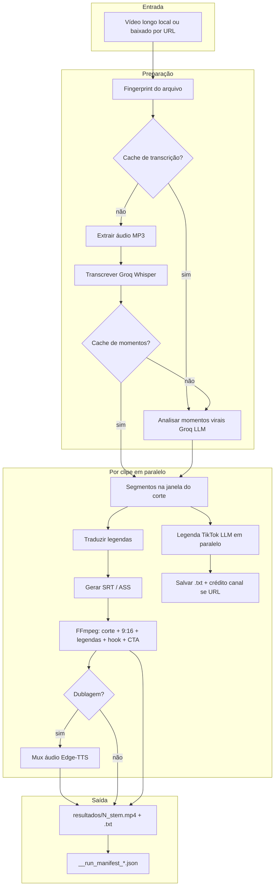
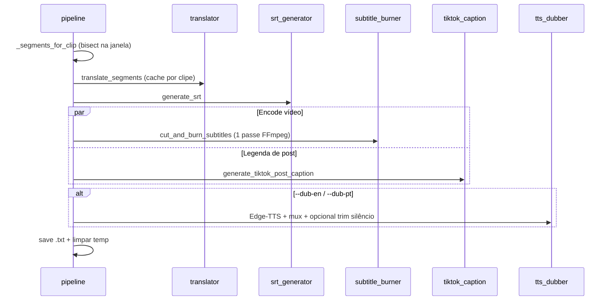
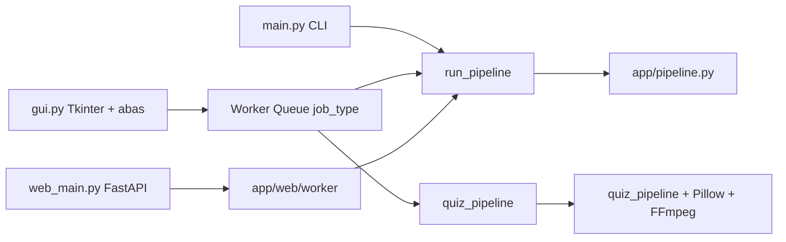
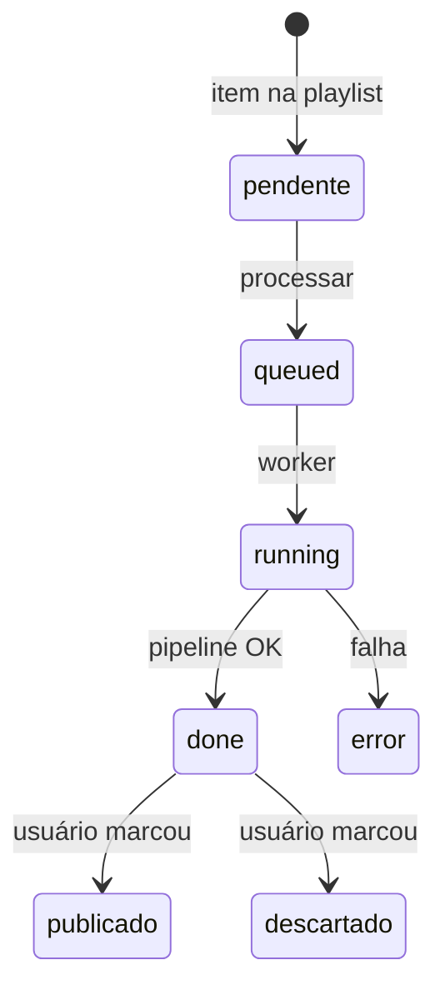
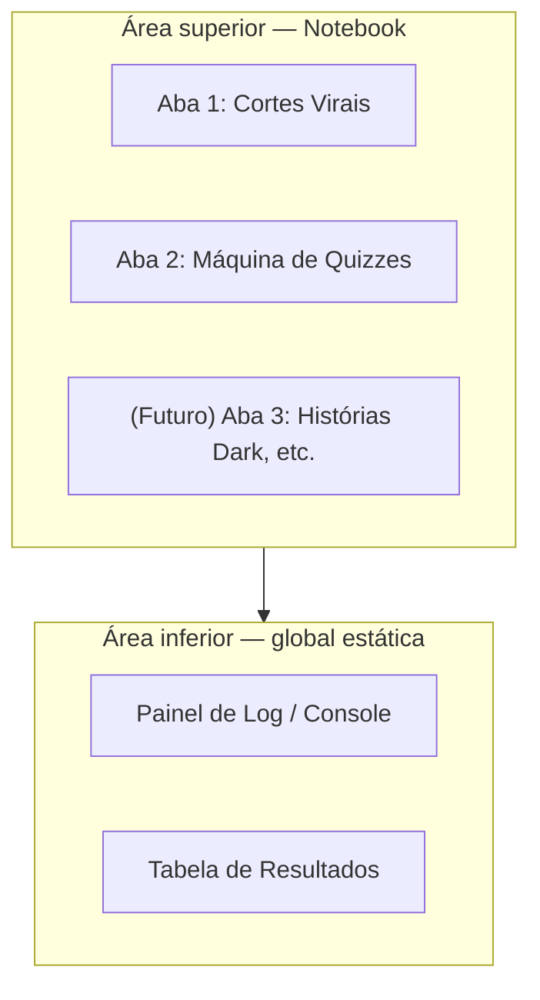
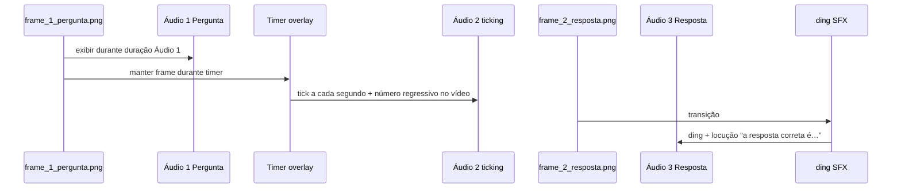

# projeto.md — Documento base do produto

> **Este arquivo é a fonte de verdade do projeto.**  
> Tudo que estiver descrito aqui deve ser respeitado ao implementar funcionalidades novas, refatorar ou corrigir bugs.  
> Se você (humano ou IA) quiser mudar o comportamento do produto, **edite este documento primeiro** e só então peça a implementação alinhada a ele.

**Última revisão:** 2026-05-20 (expansão: Geradores de Conteúto — Módulo de Quizzes)  
**Relacionados (não substituem este arquivo):** `README.md` (guia rápido), `AI_CONTEXT.md` (mapa técnico para IAs), `checklist.md` (pendências de engenharia).

---

## 1. Visão e propósito

### O que é

**meu_saas_cortes** (nome conceitual: *SaaS de Cortes Virais*) é uma **plataforma local em Python** de **geradores de conteúdo em vídeo vertical** para TikTok, Reels e Shorts.

O núcleo original transforma **vídeos longos** em clipes virais automatizados. A **expansão planejada** adiciona outros formatos no mesmo executável — começando pela **Máquina de Quizzes** (múltipla escolha com timer) — reutilizando FFmpeg (VA-API/AMD), limites assíncronos (Groq / Edge-TTS) e a GUI unificada por abas.

Não é um SaaS hospedado com login e cobrança — é software que roda na máquina do usuário (CLI, GUI desktop ou interface web local). O nome “SaaS” reflete a **intenção de produto** (automatizar produção de vídeo para redes), não a arquitetura de nuvem multi-tenant.

### Problema que resolve

Criar cortes virais manualmente exige:

1. Assistir horas de vídeo para achar “o melhor trecho”.
2. Cortar, exportar em 9:16, sincronizar legendas.
3. Traduzir ou dublar, posicionar texto para não cobrir a UI do app.
4. Escrever legenda de postagem com hashtags.

O projeto **automatiza essas etapas** com IA (transcrição + escolha de momentos + texto de post) e FFmpeg (corte, formato vertical, legendas queimadas, opcionalmente GPU e dublagem).

### Para quem ajuda

| Perfil | Como o projeto ajuda |
|--------|----------------------|
| Criador de conteúdo | Gera N clipes (~50 s) sem editar timeline à mão |
| Canal de cortes / highlights | Escala produção a partir de um vídeo-fonte longo |
| Agência / social media | Padroniza saída 9:16 + `.txt` de legenda para copiar no TikTok |
| Quem republica conteúdo de URL | Baixa via yt-dlp, processa e pode incluir **crédito ao canal** na legenda |
| Canal de quiz / curiosidades | Gera vídeos de perguntas 9:16 do zero (tema + voz), sem gravar tela |

### Geradores de conteúdo (visão da plataforma)

| Gerador | Status | Entrada típica | Saída |
|---------|--------|----------------|--------|
| **Cortes virais** | Implementado | Vídeo longo ou URL | N clipes ~50 s + `.txt` |
| **Máquina de Quizzes** | Especificado (§13) | Tema, quantidade, timer, voz | 1 MP4 concatenado + `.txt` |
| **Histórias Dark** (ex.) | Futuro | A definir neste doc | A definir |

### O que o produto **entrega** (contrato de valor — Cortes virais)

Para cada vídeo processado no gerador de cortes:

| Entrega | Descrição |
|---------|-----------|
| **N vídeos MP4** | Padrão **5** clipes de **~50 s**, **1080×1920 (9:16)**, velocidade levemente acelerada (~2%) |
| **Legendas queimadas** | No idioma escolhido (`pt` ou `en`), estilo configurável |
| **Hook no topo** | Frase curta (~3 s) sugerida pela IA no início do clipe |
| **CTA “siga o perfil”** | Texto entre ~13 s e ~15 s |
| **Arquivo `.txt` por clipe** | Legenda de postagem estilo TikTok (descrição + hashtags) |
| **Manifest JSON** | Registro da execução (opções, cache, momentos, caminhos de saída) |

Opcional (flags / GUI / web):

- **Dublagem** (Edge-TTS) substituindo o áudio original.
- **Smart crop** com detecção de rosto / falante quando há 2+ pessoas no quadro.
- **Encode em GPU** (VA-API / AMF / NVENC / QSV conforme hardware).

### O que o produto **não é** (fora do escopo atual)

- Hospedagem multi-usuário, planos pagos ou autenticação.
- Upload automático para TikTok, Instagram ou YouTube.
- Edição não-linear completa (timeline, multicam, efeitos complexos).
- Garantia jurídica de uso de conteúdo de terceiros — o usuário é responsável por direitos e políticas das plataformas.

Qualquer item acima só entra no produto se **for adicionado explicitamente neste `projeto.md`**.

---

## 2. Fluxo principal do pipeline

### Diagrama de alto nível



### Etapas numeradas (ordem real no código)

Orquestração: `app/pipeline.py` → `run_pipeline()`.

| # | Etapa | Módulo principal | Entrada → Saída |
|---|--------|------------------|-----------------|
| 0 | Garantir pastas | `config` | Cria `OUTPUT_DIR`, `TEMP_DIR` |
| 1 | Fingerprint | `app/cache.py` | Arquivo → hash estável para cache |
| 2 | Transcrição | `audio_extractor` + `transcriber` | Vídeo → lista `{start, end, text}` |
| 3 | Momentos virais | `viral_analyzer` | Transcrição → N janelas `{start, end, reason, hook}` |
| 4 | Por clipe (paralelo) | vários | Ver subfluxo abaixo |
| 5 | Manifest | `pipeline` | JSON com metadados da execução |

**Cache:** etapas 2 e 3 podem ser puladas se existir entrada em `CACHE_DIR` (padrão `~/.cache/meu_saas_cortes` no Linux) para o mesmo fingerprint e mesmas opções relevantes.

### Subfluxo de um único clipe



**Regra de implementação:** o pipeline principal **não** deve gerar MP4 intermediário só de corte; o corte e a queima de legendas ocorrem em **um único comando FFmpeg** (`cut_and_burn_subtitles`).

### Progresso (GUI / web)

O callback `progress(0.0 … 1.0)` usa marcos fixos, não tempo real de cada FFmpeg:

| Marco | Valor aprox. |
|-------|----------------|
| Início preparação | 0.02 |
| Extração de áudio | 0.05 |
| Transcrição | 0.12 → 0.48 |
| Análise viral | 0.50 → 0.58 |
| Clipes | 0.58 → 1.0 |

Multi-vídeo: progresso global = `(índice_do_vídeo + t_local) / total_vídeos`.

---

## 3. Formas de usar o sistema

Três interfaces compartilham **o mesmo núcleo** (`run_pipeline`):



| Interface | Como iniciar | Particularidades |
|-----------|--------------|------------------|
| **CLI** | `python main.py video.mp4 [opções]` | Vários arquivos; prep do próximo vídeo em paralelo com clipes do atual |
| **GUI** | `python gui.py` | **Sistema de abas** (§13.1): Cortes Virais + Máquina de Quizzes; log e resultados globais na base; worker roteia por `job_type` |
| **Web local** | `python web_main.py` (porta **8765**) | Playlist SQLite, jobs com Redis+RQ ou thread fallback, SSE de progresso |

**Bootstrap comum:** `main.py` e `gui.py` chamam `_venv_reexec.ensure_venv` (reinicia com `.venv` se existir) e `apply_linux_desktop_defaults()` no Linux.

---

## 4. Stack tecnológica

| Camada | Tecnologia | Papel |
|--------|------------|-------|
| Linguagem | Python 3.10+ | Orquestração e integrações |
| Vídeo/áudio | FFmpeg + ffprobe | Corte, encode, legendas, extração de áudio |
| IA — transcrição | Groq API (Whisper) | Áudio → segmentos com tempo |
| IA — viralidade + hook | Groq chat (`llama-3.3-70b-versatile`) | Escolha de janelas e frases de gancho |
| IA — legenda de post | Groq chat (`llama-3.1-8b-instant`) | Texto TikTok + hashtags |
| Tradução | Google Translate (`deep-translator`) | Legendas e texto para dublagem |
| TTS | Edge-TTS | Dublagem opcional |
| Smart crop | OpenCV + MediaPipe BlazeFace | Recorte 9:16 focado em rosto/falante |
| Download URL | yt-dlp | YouTube e outros hosts |
| GUI | tkinter + sv-ttk + `ttk.Notebook` | Desktop escuro, abas por gerador |
| Imagens quiz | Pillow (PIL) | Frames 9:16 estáticos antes do FFmpeg |
| Web | FastAPI, uvicorn, SQLite, Redis/RQ opcional | Fila e playlist |

**Dependência obrigatória de sistema:** FFmpeg com filtro `drawtext` (hook e CTA).

**Chave obrigatória:** `GROQ_API_KEY` no `.env`.

---

## 5. Estrutura do repositório (mapa conceitual)

```
meu_saas_cortes/
├── projeto.md              ← ESTE ARQUIVO (especificação do produto)
├── main.py                 ← CLI
├── gui.py                  ← Interface desktop (abas + fila de jobs)
├── web_main.py             ← Servidor web
├── web_worker.py           ← Worker RQ (se Redis)
├── assets/                 ← Áudio estático (ex.: ticking_5s.mp3, SFX ding)
├── app/
│   ├── config.py           ← Única fonte de constantes de ambiente
│   ├── pipeline.py         ← Orquestração Cortes Virais
│   ├── quiz_pipeline.py    ← Orquestração Máquina de Quizzes (§13)
│   ├── cache.py / cache_pipeline.py
│   ├── limits.py           ← Rate limit / retry Groq e tradução
│   ├── cancel.py           ← Cancelamento cooperativo (GUI)
│   ├── ytdlp_download.py   ← Download + atribuição de canal
│   ├── ai_integrations/    ← Groq, tradução, legenda TikTok
│   ├── video_processing/   ← FFmpeg: áudio, corte, legendas, TTS, crop
│   ├── subtitle/           ← SRT, ASS, formatação de tempo
│   └── web/                ← API, store, tasks, templates
├── resultados/             ← Saída (MP4, .txt, manifest)
├── temp/                   ← Temporários (limpos por clipe)
├── tests/                  ← pytest (lógica sem rede na maior parte)
└── .env / .env.example     ← Configuração (não versionar segredos)
```

**Regra:** novas configurações vão em `app/config.py` + comentário em `.env.example`; não espalhar `os.getenv` em módulos aleatórios.

---

## 6. Contratos de dados

### Segmento de fala

```python
{"start": float, "end": float, "text": str}
```

### Momento viral (após análise)

```python
{
  "start": float,
  "end": float,
  "reason": str,   # por que o trecho é forte (uso interno / debug)
  "hook": str      # frase curta no topo (~5 palavras)
}
```

### Nomenclatura de saída (oficial)

| Artefato | Padrão |
|----------|--------|
| Vídeo | `{OUTPUT_DIR}/{índice}_{stem_sanitizado}.mp4` — índice 1..N |
| Legenda post | Mesmo path do MP4 com extensão `.txt` |
| Manifest | `{OUTPUT_DIR}/{video_name}__run_manifest_{YYYYMMDD_HHMMSS}.json` |

`stem_sanitizado` = `sanitize_clip_output_stem()` em `app/clip_output_naming.py`.

> **Legado:** documentos antigos citam `*_viral_N.mp4` — **não usar**; o padrão atual é `{índice}_{stem}.mp4`.

### Atribuição de fonte (download por URL)

Quando o vídeo veio de yt-dlp com metadados de canal, o `.txt` pode incluir linha de crédito (templates `CAPTION_SOURCE_LINE_PT` / `_EN` com `{channel}`).

---

## 7. Comportamentos de produto (regras fixas)

Estas regras devem ser mantidas salvo mudança explícita neste documento:

1. **Formato de saída:** vertical 9:16 (padrão 1080×1920), adequado a TikTok/Reels/Shorts.
2. **Quantidade padrão:** `VIRAL_CLIPS_COUNT=5`, duração alvo `CLIP_DURATION=50` segundos (ajustável via `.env`; a IA refina janelas em torno disso).
3. **Legendas:** sempre **queimadas** no vídeo final; idiomas suportados na UI/CLI: **`pt`** e **`en`**.
4. **Hook + CTA:** parte da identidade visual do produto; não remover sem atualizar este doc.
5. **Margem de legenda:** posicionada para **não cobrir** o @ do perfil no TikTok (margens ampliadas em `subtitle_burner` / ASS).
6. **Cache persistente:** reprocessar o mesmo arquivo pode pular transcrição/análise; comportamento esperado para economia de API e tempo.
7. **Momentos virais** dependem de `output_language` na chave de cache — trocar idioma pode refazer análise.
8. **Paralelismo de clipes:** limitado por `pipeline_thread_pool_max_workers()` e semáforos CPU/GPU (`CLIP_ENCODE_PARALLEL_*`).
9. **Últimos clipes** tendem a usar encoder GPU quando há clipes suficientes e `USE_GPU_CLIP_ENCODE=1`.
10. **Publicação:** o produto **prepara** arquivos; publicar no TikTok continua **manual** (copiar `.txt`, enviar MP4).
11. **Cancelamento (GUI):** cooperativo via `request_cancel()` — não matar processos de forma abrupta sem necessidade.

---

## 8. Configuração e ambiente

Carregamento: `python-dotenv` em `app/config.py` na importação.

### Variáveis essenciais

| Variável | Obrigatória | Função |
|----------|-------------|--------|
| `GROQ_API_KEY` | Sim | Transcrição + LLMs |
| `OUTPUT_DIR` | Não | Pasta de saída (default `resultados`) |
| `TEMP_DIR` | Não | Temporários (default `temp`) |
| `CACHE_DIR` | Não | Cache persistente |
| `VIRAL_CLIPS_COUNT` | Não | Número de clipes |
| `CLIP_DURATION` | Não | Duração alvo por clipe |
| `CLIP_SPEED_UP_PERCENT` | Não | Aceleração leve anti-reupload |

Lista completa e tuning de GPU, Groq, Edge-TTS, yt-dlp: **`.env.example`**.

### Instalação recomendada

```bash
python3 -m venv .venv
.venv/bin/pip install -r requirements.txt
cp .env.example .env
# Editar GROQ_API_KEY
```

Linux com PEP 668: sempre usar venv; `main.py` / `gui.py` reexecutam com `.venv` automaticamente se existir.

---

## 9. Interface web e playlist (produto)

A web local é uma **alternativa à GUI**, não um produto separado.



| Componente | Função |
|------------|--------|
| `data/web_jobs.sqlite` | Persistência de playlist e jobs |
| `POST /api/jobs` | Job avulso (upload / opções) |
| `POST /api/playlist/process` | Processar fila |
| SSE `/api/progress` | Progresso em tempo quase real |
| Redis + `web_worker.py` | Fila RQ em produção local; sem Redis = thread no servidor |

**Regra:** novas features de fila ou workflow devem manter compatibilidade com `run_pipeline` e os status acima, ou este documento deve ser atualizado com o novo modelo de estados.

---

## 10. Qualidade, testes e evolução

### Testes

```bash
pip install -r requirements-dev.txt
pytest
```

Cobertura atual: lógica pura (segmentos, cache, parse JSON, nomes, export zip). **Não** substitui teste manual com vídeo real + FFmpeg + Groq.

### Pendências de engenharia

Ver `checklist.md` — não duplicar aqui; o checklist é operacional, este arquivo é **produto + arquitetura**.

### Roadmap de produto (neste documento)

| Item | Seção |
|------|--------|
| Máquina de Quizzes + GUI em abas | §13 (especificado — implementar conforme doc) |
| Histórias Dark e outros geradores | Adicionar subseção em §13 antes de codar |

Outras extensões só entram após edição explícita aqui:

- Novos idiomas além de `pt` / `en`.
- Mais redes de saída (ex.: 1:1 para feed).
- Upload automático via API oficial de rede social.
- Tradução via Groq em vez de Google.
- Playlist YouTube expandida em vários itens na fila.

---

## 13. Documentação de Arquitetura: Expansão de Geradores de Conteúdo

Esta seção expande o **meu_saas_cortes** para suportar **múltiplos formatos de vídeo automatizados** no TikTok, mantendo a robustez de hardware (**FFmpeg VA-API/AMD**) e limites assíncronos (**Groq / Edge-TTS**) já existentes.

**Foco inicial desta expansão:** Módulo de **Quizzes** (múltipla escolha com temporizador).

**Regra de implementação:** código novo do quiz **deve reaproveitar** os módulos listados em §13.2; não duplicar configuração de GPU, retries ou integrações LLM/TTS.

---

### 13.1. Refatoração da interface (`gui.py`) — sistema de abas

O `gui.py` deixa de ser uma tela única e passa a usar **`ttk.Notebook`** (tema **sv-ttk**).

#### Layout da janela



| Região | Comportamento |
|--------|----------------|
| **Notebook (topo)** | Cada aba é um `Frame` com inputs e botão **Iniciar** próprios |
| **Aba 1 — Cortes Virais** | Contém o layout atual do SaaS de cortes (arquivos, URLs, legendas, dublagem, etc.) |
| **Aba 2 — Máquina de Quizzes** | Novo frame com inputs da §13.3.1 |
| **Aba 3+ (futuro)** | Placeholder para outros geradores (ex.: Histórias Dark) |
| **Log + Resultados (base)** | **Sempre visíveis**; recebem saída de **qualquer** aba em processamento |

#### Worker queue e roteamento

O botão **Iniciar** de cada aba **não** chama o pipeline direto na thread da UI. Envia um **dicionário de job** para a fila de tarefas em background, por exemplo:

```python
# Cortes virais (exemplo)
{"job_type": "viral_cuts", "video_paths": [...], "lang": "pt", ...}

# Quiz (exemplo)
{"job_type": "quiz", "theme": "Futebol", "count": 5, "timer_sec": 5, "tts_voice": "pt-BR-AntonioNeural"}
```

O **worker em background** interpreta `job_type` e roteia:

| `job_type` | Destino |
|------------|---------|
| `viral_cuts` (ou equivalente legado) | `app/pipeline.py` → `run_pipeline()` |
| `quiz` | `app/quiz_pipeline.py` → `run_quiz_pipeline()` (nome sugerido) |

Objetivo: **não travar a UI** durante Groq, Edge-TTS ou FFmpeg longos; log e progresso alimentam os painéis globais inferiores (mesmo padrão de fila/`__PROGRESS__` já usado na GUI de cortes).

---

### 13.2. Componentes a serem reaproveitados

O novo código **importa do projeto base** — não reimplementa infraestrutura:

| Módulo | Uso no quiz (e futuros geradores) |
|--------|-----------------------------------|
| `app.config` | Variáveis de ambiente, `OUTPUT_DIR`, `TEMP_DIR`, fontes, `CLIP_GPU_ENCODER`, nós **VA-API** (`VAAPI_RENDER_NODE`, `ffmpeg_vaapi_*`) |
| `app.ai_integrations.groq_chat` | Chamadas LLM (`llama-3.3-70b-versatile`) com limiter/retry |
| `app.video_processing.tts_dubber` | Síntese **Edge-TTS** e medição de duração via **ffprobe** |
| `app.subtitle.srt_generator` | Quando aplicável a legendas temporizadas |
| `app.ai_integrations.tiktok_caption` | Legenda de postagem + hashtags no `.txt` final |
| `app.limits` | Retries e limitadores de concorrência Groq / Edge-TTS |

**Encode de vídeo do quiz:** usar o mesmo encoder configurado em `CLIP_GPU_ENCODER` (ex.: `h264_vaapi` no Linux + Mesa/AMD), com fallback CPU conforme padrão já existente em `subtitle_burner` / `video_cutter`.

---

### 13.3. Especificação técnica: Máquina de Quizzes (`quiz_pipeline.py`)

Módulo para criação de vídeos de **perguntas de múltipla escolha com temporizador**, **do zero** (sem vídeo-fonte), usando **imagens estáticas (Pillow)** e **montagem FFmpeg**.

Arquivo alvo: `app/quiz_pipeline.py` (orquestração) + módulos auxiliares conforme necessário (ex.: `app/quiz/` para LLM, layout PIL, montagem FFmpeg).

#### 13.3.1. Inputs da interface (Aba 2)

| Campo | Tipo | Padrão | Descrição |
|-------|------|--------|-----------|
| **Tema / Nicho** | Texto livre | — | Ex.: `"Futebol"`, `"Geografia"` |
| **Quantidade de perguntas** | Slider | **5** | N perguntas no vídeo final |
| **Tempo de resposta (timer)** | Slider (segundos) | **5 s** | Duração da fase “tic-tac” antes de revelar resposta |
| **Voz da dublagem** | Dropdown | Voz Edge-TTS do projeto | Mesmas opções / env que cortes (`EDGE_TTS_VOICE_PT`, etc.) |

Esses valores entram no payload `job_type: "quiz"` da fila (§13.1).

#### 13.3.2. Etapa 1 — Geração de dados (LLM — Groq)

Uma chamada (ou lote controlado por `count`) ao Groq via `groq_chat`, com prompt que **force saída estritamente JSON** e **limites rígidos de caracteres** (layout visual não pode estourar).

| Campo | Regra |
|-------|--------|
| **Pergunta** | Máximo **120** caracteres |
| **Opções** | Exatamente **4** alternativas (A, B, C, D); máximo **35** caracteres cada |
| **Resposta correta** | Índice inteiro **0 a 3** |
| **Curiosidade** | Máximo **150** caracteres (`curiosidade_extra`) |

**Esquema JSON esperado** (array com `count` objetos):

```json
[
  {
    "pergunta": "Qual é o maior planeta do sistema solar?",
    "opcoes": ["Terra", "Marte", "Júpiter", "Saturno"],
    "resposta_correta": 2,
    "curiosidade_extra": "Júpiter é tão grande que caberiam mais de 1.300 Terras dentro dele."
  }
]
```

**Regras de parse:** rejeitar ou reparar entradas fora dos limites; falha de JSON → retry via `app.limits` (mesma política Groq dos outros módulos).

#### 13.3.3. Etapa 2 — Áudio e timestamps (Edge-TTS)

Para **cada pergunta**, gerar **três blocos de áudio**; duração de cada bloco obtida com **ffprobe** (reutilizar utilitários de `tts_dubber` / `config.FFPROBE_PATH`).

| Áudio | Conteúdo | Origem |
|-------|----------|--------|
| **Áudio 1 — Pergunta** | TTS lê **só a pergunta** (alternativas ficam no vídeo) | Edge-TTS |
| **Áudio 2 — Timer** | Um **tick por segundo** durante a espera (asset `assets/ticking_5s.mp3` ou beep sintético) | FFmpeg (`adelay` + `amix`) |
| **Áudio 3 — Resposta** | TTS: “A resposta correta é…” + opção certa + curiosidade (sem reler as 4 alternativas) | Edge-TTS + ding opcional no FFmpeg |

Os timestamps destes áudios definem a linha do tempo de cada “pergunta” na montagem FFmpeg.

#### 13.3.4. Etapa 3 — Geração visual (Pillow / PIL)

Gerar **frames estáticos 9:16** em **1080×1920** em Python (alivia CPU do FFmpeg em layouts complexos).

**Safe zone TikTok** (margens obrigatórias):

- Laterais: ~**150 px**
- Topo e rodapé: ~**300 px**

**Layout base (por frame):**

| Zona | Conteúdo |
|------|----------|
| Terço superior | Pergunta — negrito, centralizada, `textwrap` |
| Centro | 4 botões (retângulos arredondados) empilhados |
| Centro-baixo | Contagem regressiva numérica (sobreposição FFmpeg `drawtext`, ex.: 5→4→3→2→1) |
| Terço inferior | Área da curiosidade (preenchida no frame de resposta) |

**Dois PNG por pergunta:**

| Arquivo | Visual |
|---------|--------|
| `frame_1_pergunta.png` | Botões cor padrão; área inferior da curiosidade **vazia** |
| `frame_2_resposta.png` | Botão correto em destaque (ex.: **verde**); demais opções opacas / tom avermelhado; **curiosidade** no rodapé |

Salvar temporários em `TEMP_DIR`; limpar após concatenação final.

#### 13.3.5. Etapa 4 — Montagem final (FFmpeg)

Concatenação por pergunta, depois **todas as perguntas** em **um único MP4** em `OUTPUT_DIR`. Usar encoder de hardware quando `USE_GPU_CLIP_ENCODE` e `CLIP_GPU_ENCODER` estiverem ativos (ex.: **h264_vaapi**).

**Sequência por pergunta:**



| Fase | Vídeo | Áudio |
|------|-------|-------|
| 1 | `frame_1` pela duração do **Áudio 1** | Locução pergunta + opções |
| 2 | `frame_1` durante **timer** | **Áudio 2** (tick/s) + overlay numérico regressivo (`drawtext`) |
| 3 | `frame_2` pela duração do **Áudio 3** | **Ding** + TTS da resposta correta e curiosidade |

Após montar cada pergunta, **concatenar** segmentos + **encerramento** (frame + TTS: “E aí, foi bem? Comenta quantas você acertou.”) → arquivo final único.

**Saídas obrigatórias:**

| Artefato | Padrão sugerido |
|----------|-----------------|
| Vídeo | `{OUTPUT_DIR}/quiz_{tema_sanitizado}_{timestamp}.mp4` (definir função de nome em implementação; seguir espírito de `clip_output_naming`) |
| Legenda TikTok | `{mesmo_stem}.txt` via `tiktok_caption` (tema + hashtags; pode resumir perguntas do JSON) |

#### 13.3.6. Fluxo completo do quiz (diagrama)

```mermaid
flowchart TB
    IN[Inputs: tema, count, timer, voz]
    LLM[Groq: JSON perguntas]
    subgraph Por pergunta
        TTS1[Edge-TTS pergunta+opções]
        TTS2[assets ticking]
        TTS3[Edge-TTS resposta+curiosidade]
        PIL1[frame_1_pergunta.png]
        PIL2[frame_2_resposta.png]
        FF[FFmpeg: fases 1-2-3 + encode GPU]
    end
    CAT[Concatenar N perguntas]
    CAP[Legenda .txt TikTok]
    OUT[MP4 + txt em OUTPUT_DIR]

    IN --> LLM --> Por pergunta
    TTS1 --> PIL1
    TTS1 --> FF
    TTS2 --> FF
    TTS3 --> PIL2 --> FF
    Por pergunta --> CAT --> CAP --> OUT
```

#### 13.3.7. Contrato de dados — pergunta de quiz

```python
{
  "pergunta": str,           # len <= 120
  "opcoes": list[str],       # len == 4, cada str <= 35
  "resposta_correta": int,   # 0..3
  "curiosidade_extra": str,  # len <= 150
}
```

#### 13.3.8. Regras de produto específicas do quiz

1. Sempre **9:16** (1080×1920), mesmo padrão dos cortes.
2. Sempre **4 opções**; resposta única por pergunta.
3. Timer configurável na UI; durante a espera exibir **contagem regressiva** (N→1) e **um tick/s**; na revelação o TTS diz **“A resposta correta é…”** (sem ler as 4 alternativas na fase da pergunta).
4. Respeitar **safe zones** do TikTok no PIL — texto e botões não invadem margens da §13.3.4.
5. Respeitar `EDGE_TTS_MAX_CONCURRENT` e `groq_limiter` ao gerar N perguntas.
6. Publicação TikTok continua **manual** (`.txt` + MP4).
7. Cancelamento na GUI deve usar o mesmo `request_cancel()` / `run_cancelable` que os cortes.

---

### 13.4. Futuro: outros geradores (placeholder)

Novos formatos (ex.: **Histórias Dark**) seguem o mesmo padrão:

1. Nova aba no `ttk.Notebook`.
2. Novo `job_type` na fila do worker.
3. Novo `*_pipeline.py` reutilizando §13.2.
4. Especificação adicionada **nesta seção 13** antes de qualquer implementação.

---


## 11. Como usar este documento ao pedir mudanças

### Para o humano (dono do projeto)

1. Edite a seção relevante (ex.: adicionar idioma `es` na tabela de idiomas e no contrato de valor).
2. Peça implementação citando: *“siga o `projeto.md` atualizado”*.
3. Se a mudança for só técnica interna (refactor, performance), pode ir só no `checklist.md` ou `AI_CONTEXT.md`.

### Para agentes de IA

Ao receber uma tarefa de código:

1. **Ler `projeto.md` primeiro** — prevalece sobre README desatualizado ou suposições.
2. **Não contradizer** regras da seção 7 e contratos da seção 6.
3. **Minimizar escopo** — não adicionar multi-tenant, auth ou upload automático sem estar aqui.
4. Após implementar feature de produto, **sugerir atualização** deste arquivo se o comportamento visível ao usuário mudou.
5. `AI_CONTEXT.md` é complementar (mapa de arquivos, detalhes de env, testes) — não substitui este doc.

### Diferença entre os documentos

| Arquivo | Papel |
|---------|--------|
| **projeto.md** | O que o produto é, deve fazer e como deve evoluir (**base**) |
| **AI_CONTEXT.md** | Mapa rápido do código para IAs |
| **README.md** | Instalação e uso rápido |
| **FLUXO_DE_DADOS.md** | Fluxo simplificado (pode estar atrás do código) |
| **checklist.md** | Tarefas técnicas pendentes |

---

## 12. Resumo em uma frase

**Plataforma local de vídeos verticais para TikTok:** o gerador de **cortes virais** transforma vídeo longo em clipes com IA + FFmpeg; a expansão de **geradores** (primeiro **quizzes** com PIL + timer + TTS) usa a mesma infraestrutura (Groq, Edge-TTS, VA-API) e uma **GUI em abas** com fila de jobs — tudo configurável por `.env` e especificado neste documento.

Qualquer código novo deve fazer sentido nesse escopo ou exigir atualização deste documento (em especial **§13** para formatos além de cortes).
